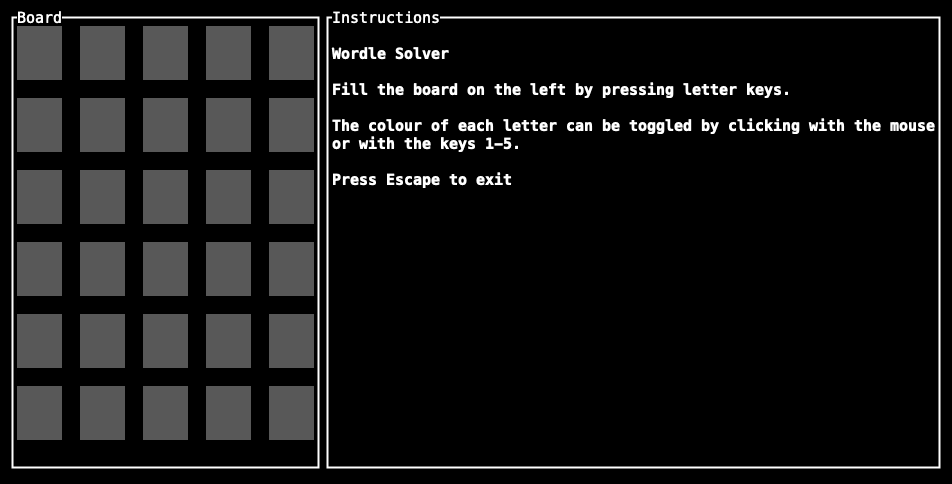

# Wordle Solver

A solver for New York Times [Wordle](https://www.nytimes.com/games/wordle/index.html)

## Running

To run, either execute the convenience script:

```bash
./solve.sh
```

or run manually via cargo:

```bash
cargo run --release
```

## Usage

Type letters to fill the board. Toggle letter state by clicking with the mouse or pressing 1-5 to toggle the last letter in each column. Escape key exits.

## Demo



## Included word list

The included words.txt file comes from [https://github.com/dwyl/english-words] which originally came from [https://www.infochimps.com/datasets/word-list-350000-simple-english-words-excel-readable].
